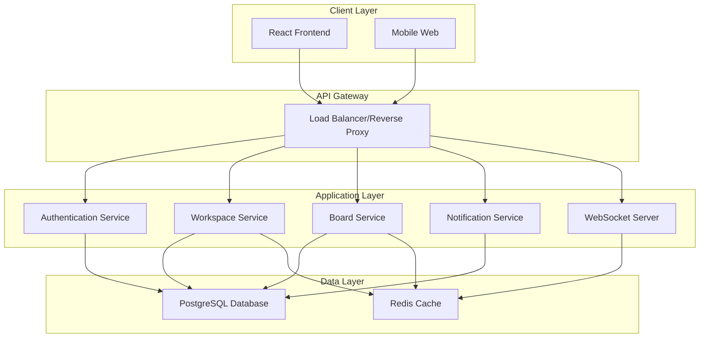
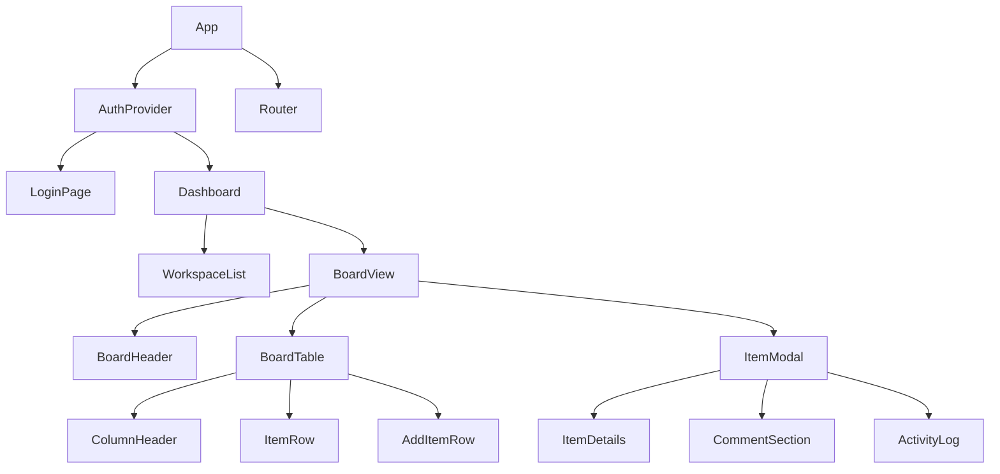

# Design Document

## Overview

The project management platform will be built as a modern, scalable web application following a microservices-inspired architecture with a React frontend and Node.js backend. The system will use PostgreSQL for data persistence, implement real-time features through WebSockets, and be fully containerized with Docker for easy deployment and scaling.

The application follows a multi-tenant architecture where workspaces serve as the primary organizational unit, containing boards that hold items with customizable fields. The design emphasizes performance, scalability, and maintainability while providing a user experience similar to Monday.com.

## Architecture

### High-Level Architecture



### Technology Stack

**Frontend:**
- React 18 with TypeScript
- Tailwind CSS for styling
- Shadcn/ui component library
- Zustand for state management
- React Query for server state
- React Hook Form for form handling
- React DnD for drag and drop
- Socket.io-client for real-time features

**Backend:**
- Node.js with Express.js
- TypeScript for type safety
- Prisma ORM for database operations
- Socket.io for WebSocket connections
- JWT for authentication
- Bcrypt for password hashing
- Joi for input validation
- Winston for logging

**Database & Infrastructure:**
- PostgreSQL for primary data storage
- Redis for caching and session storage
- Docker & Docker Compose for containerization
- Nginx as reverse proxy

## Components and Interfaces

### Frontend Component Architecture



### Key Frontend Components

**1. Authentication Components**
- `LoginForm`: Email/password authentication
- `RegisterForm`: User registration with validation
- `ForgotPasswordForm`: Password reset functionality
- `AuthGuard`: Route protection wrapper

**2. Workspace Components**
- `WorkspaceSelector`: Dropdown for workspace switching
- `WorkspaceSettings`: Admin panel for workspace configuration
- `UserInvitation`: Interface for inviting team members
- `MemberManagement`: User role and permission management

**3. Board Components**
- `BoardGrid`: Main table view with drag-and-drop
- `ColumnManager`: Add/edit/remove columns
- `FilterBar`: Filtering and search interface
- `ViewSelector`: Save and switch between different views
- `ItemCard`: Individual item representation

**4. Item Components**
- `ItemModal`: Detailed item view and editing
- `FieldRenderer`: Dynamic field type rendering
- `CommentThread`: Comments with mentions and replies
- `ActivityTimeline`: Chronological activity display

### Backend API Structure

**Authentication Endpoints**
```typescript
POST /api/auth/register
POST /api/auth/login
POST /api/auth/logout
POST /api/auth/refresh
POST /api/auth/forgot-password
POST /api/auth/reset-password
```

**Workspace Endpoints**
```typescript
GET /api/workspaces
POST /api/workspaces
GET /api/workspaces/:id
PUT /api/workspaces/:id
DELETE /api/workspaces/:id
POST /api/workspaces/:id/invite
GET /api/workspaces/:id/members
PUT /api/workspaces/:id/members/:userId
```

**Board Endpoints**
```typescript
GET /api/workspaces/:workspaceId/boards
POST /api/workspaces/:workspaceId/boards
GET /api/boards/:id
PUT /api/boards/:id
DELETE /api/boards/:id
GET /api/boards/:id/items
POST /api/boards/:id/items
PUT /api/items/:id
DELETE /api/items/:id
```

## Data Models

### Database Schema

```sql
-- Users table
CREATE TABLE users (
    id UUID PRIMARY KEY DEFAULT gen_random_uuid(),
    email VARCHAR(255) UNIQUE NOT NULL,
    password_hash VARCHAR(255) NOT NULL,
    first_name VARCHAR(100) NOT NULL,
    last_name VARCHAR(100) NOT NULL,
    avatar_url VARCHAR(500),
    created_at TIMESTAMP DEFAULT CURRENT_TIMESTAMP,
    updated_at TIMESTAMP DEFAULT CURRENT_TIMESTAMP
);

-- Workspaces table
CREATE TABLE workspaces (
    id UUID PRIMARY KEY DEFAULT gen_random_uuid(),
    name VARCHAR(255) NOT NULL,
    description TEXT,
    owner_id UUID REFERENCES users(id) ON DELETE CASCADE,
    created_at TIMESTAMP DEFAULT CURRENT_TIMESTAMP,
    updated_at TIMESTAMP DEFAULT CURRENT_TIMESTAMP
);

-- Workspace members table
CREATE TABLE workspace_members (
    id UUID PRIMARY KEY DEFAULT gen_random_uuid(),
    workspace_id UUID REFERENCES workspaces(id) ON DELETE CASCADE,
    user_id UUID REFERENCES users(id) ON DELETE CASCADE,
    role VARCHAR(50) NOT NULL DEFAULT 'member',
    joined_at TIMESTAMP DEFAULT CURRENT_TIMESTAMP,
    UNIQUE(workspace_id, user_id)
);

-- Boards table
CREATE TABLE boards (
    id UUID PRIMARY KEY DEFAULT gen_random_uuid(),
    workspace_id UUID REFERENCES workspaces(id) ON DELETE CASCADE,
    name VARCHAR(255) NOT NULL,
    description TEXT,
    color VARCHAR(7) DEFAULT '#0073ea',
    created_by UUID REFERENCES users(id),
    created_at TIMESTAMP DEFAULT CURRENT_TIMESTAMP,
    updated_at TIMESTAMP DEFAULT CURRENT_TIMESTAMP
);

-- Board columns table
CREATE TABLE board_columns (
    id UUID PRIMARY KEY DEFAULT gen_random_uuid(),
    board_id UUID REFERENCES boards(id) ON DELETE CASCADE,
    name VARCHAR(255) NOT NULL,
    type VARCHAR(50) NOT NULL, -- text, status, people, date, tags, number
    settings JSONB DEFAULT '{}',
    position INTEGER NOT NULL,
    created_at TIMESTAMP DEFAULT CURRENT_TIMESTAMP
);

-- Board items table
CREATE TABLE board_items (
    id UUID PRIMARY KEY DEFAULT gen_random_uuid(),
    board_id UUID REFERENCES boards(id) ON DELETE CASCADE,
    name VARCHAR(500) NOT NULL,
    position INTEGER NOT NULL,
    created_by UUID REFERENCES users(id),
    created_at TIMESTAMP DEFAULT CURRENT_TIMESTAMP,
    updated_at TIMESTAMP DEFAULT CURRENT_TIMESTAMP
);

-- Item field values table
CREATE TABLE item_field_values (
    id UUID PRIMARY KEY DEFAULT gen_random_uuid(),
    item_id UUID REFERENCES board_items(id) ON DELETE CASCADE,
    column_id UUID REFERENCES board_columns(id) ON DELETE CASCADE,
    value JSONB,
    created_at TIMESTAMP DEFAULT CURRENT_TIMESTAMP,
    updated_at TIMESTAMP DEFAULT CURRENT_TIMESTAMP,
    UNIQUE(item_id, column_id)
);

-- Comments table
CREATE TABLE comments (
    id UUID PRIMARY KEY DEFAULT gen_random_uuid(),
    item_id UUID REFERENCES board_items(id) ON DELETE CASCADE,
    user_id UUID REFERENCES users(id) ON DELETE CASCADE,
    content TEXT NOT NULL,
    mentions UUID[] DEFAULT '{}',
    created_at TIMESTAMP DEFAULT CURRENT_TIMESTAMP,
    updated_at TIMESTAMP DEFAULT CURRENT_TIMESTAMP
);

-- Activity log table
CREATE TABLE activity_logs (
    id UUID PRIMARY KEY DEFAULT gen_random_uuid(),
    item_id UUID REFERENCES board_items(id) ON DELETE CASCADE,
    user_id UUID REFERENCES users(id) ON DELETE CASCADE,
    action VARCHAR(100) NOT NULL,
    details JSONB DEFAULT '{}',
    created_at TIMESTAMP DEFAULT CURRENT_TIMESTAMP
);

-- Notifications table
CREATE TABLE notifications (
    id UUID PRIMARY KEY DEFAULT gen_random_uuid(),
    user_id UUID REFERENCES users(id) ON DELETE CASCADE,
    type VARCHAR(100) NOT NULL,
    title VARCHAR(255) NOT NULL,
    message TEXT,
    data JSONB DEFAULT '{}',
    read BOOLEAN DEFAULT FALSE,
    created_at TIMESTAMP DEFAULT CURRENT_TIMESTAMP
);
```

### TypeScript Interfaces

```typescript
interface User {
  id: string;
  email: string;
  firstName: string;
  lastName: string;
  avatarUrl?: string;
  createdAt: Date;
  updatedAt: Date;
}

interface Workspace {
  id: string;
  name: string;
  description?: string;
  ownerId: string;
  members: WorkspaceMember[];
  boards: Board[];
  createdAt: Date;
  updatedAt: Date;
}

interface Board {
  id: string;
  workspaceId: string;
  name: string;
  description?: string;
  color: string;
  columns: BoardColumn[];
  items: BoardItem[];
  createdBy: string;
  createdAt: Date;
  updatedAt: Date;
}

interface BoardColumn {
  id: string;
  boardId: string;
  name: string;
  type: 'text' | 'status' | 'people' | 'date' | 'tags' | 'number';
  settings: Record<string, any>;
  position: number;
}

interface BoardItem {
  id: string;
  boardId: string;
  name: string;
  position: number;
  fieldValues: ItemFieldValue[];
  comments: Comment[];
  activities: ActivityLog[];
  createdBy: string;
  createdAt: Date;
  updatedAt: Date;
}
```

## Error Handling

### Frontend Error Handling

**1. API Error Handling**
- Centralized error interceptor using React Query
- User-friendly error messages with toast notifications
- Automatic retry for transient failures
- Fallback UI components for critical failures

**2. Form Validation**
- Real-time validation using React Hook Form
- Server-side validation error display
- Field-level error messages
- Form submission state management

**3. Network Error Handling**
- Offline detection and user notification
- Request queuing for offline scenarios
- Automatic reconnection for WebSocket connections
- Loading states and skeleton screens

### Backend Error Handling

**1. Structured Error Responses**
```typescript
interface ApiError {
  code: string;
  message: string;
  details?: Record<string, any>;
  timestamp: string;
  path: string;
}
```

**2. Error Categories**
- Authentication errors (401)
- Authorization errors (403)
- Validation errors (400)
- Not found errors (404)
- Server errors (500)

**3. Error Middleware**
- Global error handler
- Request logging and monitoring
- Error sanitization for production
- Database transaction rollback

## Testing Strategy

### Frontend Testing

**1. Unit Testing**
- Component testing with React Testing Library
- Custom hook testing
- Utility function testing
- State management testing

**2. Integration Testing**
- API integration tests
- User workflow testing
- Cross-component interaction testing
- WebSocket connection testing

**3. End-to-End Testing**
- Critical user journey testing with Playwright
- Cross-browser compatibility testing
- Mobile responsiveness testing
- Performance testing

### Backend Testing

**1. Unit Testing**
- Service layer testing
- Database model testing
- Utility function testing
- Authentication middleware testing

**2. Integration Testing**
- API endpoint testing
- Database integration testing
- WebSocket event testing
- Third-party service integration testing

**3. Performance Testing**
- Load testing with concurrent users
- Database query performance testing
- Memory usage monitoring
- Response time benchmarking

### Testing Infrastructure

**1. Test Database**
- Separate test database instance
- Database seeding for consistent test data
- Transaction rollback after each test
- Test data factories

**2. Mocking Strategy**
- External service mocking
- Database mocking for unit tests
- WebSocket connection mocking
- File upload mocking

**3. Continuous Integration**
- Automated test execution on pull requests
- Code coverage reporting
- Performance regression detection
- Security vulnerability scanning

## Security Considerations

**1. Authentication & Authorization**
- JWT token-based authentication
- Role-based access control (RBAC)
- Workspace-level permissions
- API rate limiting

**2. Data Protection**
- Input validation and sanitization
- SQL injection prevention
- XSS protection
- CSRF protection

**3. Infrastructure Security**
- HTTPS enforcement
- Environment variable management
- Database connection encryption
- Container security best practices