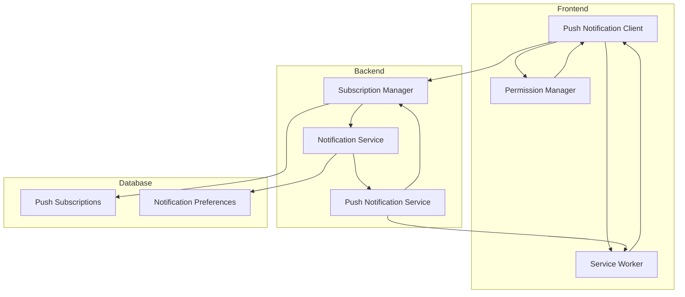

# Design Document

## Overview

The Push Notification feature will extend our existing notification system to deliver browser-based push notifications to users, even when they're not actively using the application. This feature will leverage the Web Push API, which is supported by modern browsers, to send notifications to users' devices. The implementation will include subscription management, secure payload delivery, and user preference controls.

This design document outlines the technical approach for implementing push notifications, including the necessary backend services, database schema changes, and frontend components. The solution is designed to be secure, scalable, and respectful of user preferences.

## Architecture

### High-Level Architecture



### Technology Stack

The push notification feature will utilize the following technologies:

**Frontend:**
- Web Push API for browser notifications
- Service Workers for background notification handling
- IndexedDB for local notification storage
- React hooks for permission management

**Backend:**
- Web-push library for sending push notifications
- VAPID (Voluntary Application Server Identification) for secure push messaging
- Redis for temporary notification queue
- PostgreSQL for subscription storage

**Security:**
- HTTPS for secure communication
- JWT for authentication
- Encryption for subscription endpoints and keys

## Components and Interfaces

### Backend Components

#### 1. Push Notification Service

The Push Notification Service will be responsible for sending push notifications to subscribed devices.

```typescript
interface PushNotificationService {
  sendPushNotification(
    subscription: PushSubscription,
    payload: PushNotificationPayload
  ): Promise<void>;
  
  sendToUser(
    userId: string,
    notification: Notification
  ): Promise<SendResult>;
  
  sendToMultipleUsers(
    userIds: string[],
    notification: Notification
  ): Promise<SendResult[]>;
}

interface PushNotificationPayload {
  title: string;
  body: string;
  icon?: string;
  badge?: string;
  image?: string;
  data?: {
    url?: string;
    action?: string;
    [key: string]: any;
  };
}

interface SendResult {
  userId: string;
  success: boolean;
  sent: number;
  failed: number;
  errors?: Error[];
}
```

#### 2. Subscription Manager

The Subscription Manager will handle the storage and retrieval of push notification subscriptions.

```typescript
interface SubscriptionManager {
  saveSubscription(
    userId: string,
    subscription: PushSubscription,
    userAgent: string
  ): Promise<StoredSubscription>;
  
  getSubscriptions(userId: string): Promise<StoredSubscription[]>;
  
  removeSubscription(subscriptionId: string): Promise<void>;
  
  removeAllUserSubscriptions(userId: string): Promise<void>;
  
  isSubscribed(userId: string): Promise<boolean>;
}

interface StoredSubscription {
  id: string;
  userId: string;
  endpoint: string;
  p256dh: string;
  auth: string;
  userAgent: string;
  createdAt: Date;
  lastUsed: Date;
}
```

### Frontend Components

#### 1. Push Notification Client

The Push Notification Client will manage the browser-side aspects of push notifications.

```typescript
interface PushNotificationClient {
  requestPermission(): Promise<NotificationPermission>;
  
  getPermissionStatus(): NotificationPermission;
  
  registerServiceWorker(): Promise<ServiceWorkerRegistration>;
  
  subscribe(): Promise<PushSubscription | null>;
  
  unsubscribe(): Promise<boolean>;
  
  isSubscribed(): Promise<boolean>;
}
```

#### 2. Permission Manager

The Permission Manager will handle user permission requests and tracking.

```typescript
interface PermissionManager {
  canAskForPermission(): boolean;
  
  shouldPromptForPermission(): boolean;
  
  recordPermissionRequest(result: NotificationPermission): void;
  
  getLastPermissionRequest(): {
    timestamp: number;
    result: NotificationPermission;
  } | null;
}
```

### API Endpoints

```typescript
// Subscribe to push notifications
POST /api/notifications/push/subscribe
Request: {
  subscription: PushSubscription;
  userAgent: string;
}
Response: {
  success: boolean;
  subscriptionId: string;
}

// Unsubscribe from push notifications
DELETE /api/notifications/push/unsubscribe
Request: {
  subscriptionId?: string; // If not provided, unsubscribe current device
}
Response: {
  success: boolean;
}

// Check subscription status
GET /api/notifications/push/status
Response: {
  subscribed: boolean;
  subscriptions: number; // Number of subscribed devices
}

// Update push notification preferences
PUT /api/notifications/preferences/push
Request: {
  enabled: boolean;
  types: {
    mentions: boolean;
    assignments: boolean;
    comments: boolean;
    dueDates: boolean;
    workspaceInvitations: boolean;
  }
}
Response: {
  success: boolean;
  preferences: NotificationPreferences;
}
```

## Data Models

### Database Schema Changes

```sql
-- Push subscription table
CREATE TABLE push_subscriptions (
  id VARCHAR(255) PRIMARY KEY,
  "userId" VARCHAR(255) NOT NULL,
  endpoint TEXT NOT NULL,
  p256dh TEXT NOT NULL,
  auth TEXT NOT NULL,
  "userAgent" TEXT,
  "createdAt" TIMESTAMP DEFAULT CURRENT_TIMESTAMP,
  "lastUsed" TIMESTAMP DEFAULT CURRENT_TIMESTAMP,
  FOREIGN KEY ("userId") REFERENCES users(id) ON DELETE CASCADE
);

-- Add push notification fields to notification_preferences
ALTER TABLE notification_preferences
ADD COLUMN "pushEnabled" BOOLEAN DEFAULT TRUE,
ADD COLUMN "pushMentions" BOOLEAN DEFAULT TRUE,
ADD COLUMN "pushAssignments" BOOLEAN DEFAULT TRUE,
ADD COLUMN "pushComments" BOOLEAN DEFAULT TRUE,
ADD COLUMN "pushDueDates" BOOLEAN DEFAULT TRUE,
ADD COLUMN "pushWorkspaceInvitations" BOOLEAN DEFAULT TRUE;

-- Create indexes
CREATE INDEX idx_push_subscriptions_user_id ON push_subscriptions("userId");
CREATE INDEX idx_push_subscriptions_endpoint ON push_subscriptions(endpoint);
```

### TypeScript Interfaces

```typescript
interface PushSubscription {
  endpoint: string;
  keys: {
    p256dh: string;
    auth: string;
  };
}

interface PushNotificationPreferences {
  pushEnabled: boolean;
  pushMentions: boolean;
  pushAssignments: boolean;
  pushComments: boolean;
  pushDueDates: boolean;
  pushWorkspaceInvitations: boolean;
}

// Extended notification preferences
interface NotificationPreferences {
  userId: string;
  emailNotifications: boolean;
  pushNotifications: boolean;
  mentionNotifications: boolean;
  assignmentNotifications: boolean;
  commentNotifications: boolean;
  dueDateReminders: boolean;
  workspaceInvitations: boolean;
  // New push-specific preferences
  pushEnabled: boolean;
  pushMentions: boolean;
  pushAssignments: boolean;
  pushComments: boolean;
  pushDueDates: boolean;
  pushWorkspaceInvitations: boolean;
}
```

## Error Handling

### Backend Error Handling

1. **Subscription Errors**
   - Invalid subscription format: Return 400 Bad Request
   - Expired subscription: Remove from database and log
   - Database errors: Log and return 500 Internal Server Error

2. **Push Notification Sending Errors**
   - Endpoint not found (410): Remove subscription and log
   - Unauthorized (401): Log and retry with new VAPID keys
   - Network errors: Queue for retry with exponential backoff
   - Rate limiting: Implement throttling and prioritization

### Frontend Error Handling

1. **Permission Errors**
   - Permission denied: Store in local storage and don't ask again for 7 days
   - Not supported: Gracefully degrade and hide push notification options
   - Service worker registration failure: Retry with exponential backoff

2. **Subscription Errors**
   - Failed to subscribe: Show error message and provide manual retry option
   - Failed to unsubscribe: Log error and allow force unsubscribe option

## Testing Strategy

### Backend Testing

1. **Unit Testing**
   - Push notification service methods
   - Subscription manager CRUD operations
   - Permission validation logic
   - Notification payload formatting

2. **Integration Testing**
   - API endpoint functionality
   - Database operations for subscriptions
   - Integration with existing notification service
   - Error handling and recovery

3. **Performance Testing**
   - Load testing with multiple subscriptions
   - Concurrent notification sending
   - Database query optimization

### Frontend Testing

1. **Unit Testing**
   - Permission management hooks
   - Subscription state management
   - Notification display components

2. **Integration Testing**
   - Service worker registration and functionality
   - Push subscription flow
   - Notification interaction handling

3. **Browser Compatibility Testing**
   - Test across Chrome, Firefox, Safari, and Edge
   - Mobile browser testing
   - Feature detection and graceful degradation

## Security Considerations

1. **VAPID Key Management**
   - Generate and store VAPID keys securely
   - Rotate keys periodically
   - Use environment variables for key storage

2. **Subscription Data Protection**
   - Encrypt sensitive subscription data
   - Implement access controls for subscription data
   - Regular cleanup of unused subscriptions

3. **Notification Content Security**
   - Limit sensitive information in notification payloads
   - Use notification actions instead of including sensitive data
   - Implement proper authentication for notification interactions

4. **Service Worker Security**
   - Secure service worker registration
   - Proper scope configuration
   - Regular updates to patch security vulnerabilities

## Implementation Considerations

1. **Browser Compatibility**
   - The Web Push API is supported in Chrome, Firefox, Edge, and Opera
   - Safari has limited support through a different API
   - Implement feature detection and graceful degradation

2. **Service Worker Lifecycle**
   - Implement proper service worker update mechanism
   - Handle service worker activation and claiming
   - Manage service worker cache

3. **Offline Support**
   - Store recent notifications in IndexedDB
   - Implement offline notification queue
   - Sync when connection is restored

4. **Battery and Performance Impact**
   - Optimize notification frequency
   - Implement intelligent batching
   - Respect battery status API when available