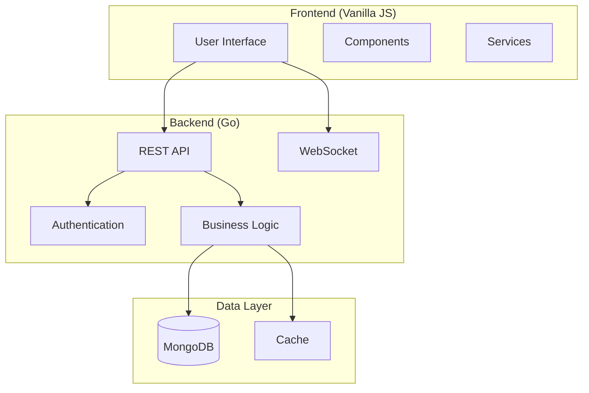

# Project Management Platform - Documentation Index

Welcome to the comprehensive documentation for the Project Management Platform - a modern, production-grade project management tool built with Go and vanilla JavaScript.

## 📋 Documentation Overview

This documentation provides detailed coverage of the entire codebase, from high-level architecture to individual file implementations. The documentation is organized for easy navigation and cross-referencing.

## 🗂️ Documentation Structure

### High-Level Documentation

1. **[Project Overview](./overview.md)**
   - Project purpose and goals
   - Technology stack overview
   - Key features and capabilities
   - Architecture summary
   - Getting started guide

2. **[System Architecture](./architecture.md)**
   - Detailed system architecture diagrams
   - Component interactions
   - Data flow patterns
   - Security architecture
   - Scalability considerations

3. **[API Documentation](./api.md)**
   - Complete REST API reference
   - Authentication flows
   - Request/response examples
   - Error codes and handling
   - WebSocket endpoints

4. **[Data Models](./data_models.md)**
   - Database schema and relationships
   - Entity relationship diagrams
   - Index strategies
   - Data validation rules
   - Performance optimizations

5. **[Frontend Architecture](./frontend.md)**
   - Vanilla JavaScript component system
   - State management patterns
   - UI component documentation
   - Performance optimizations
   - Mobile responsiveness

6. **[Deployment Guide](./deployment.md)**
   - Development environment setup
   - Production deployment strategies
   - Docker containerization
   - Cloud deployment options
   - Monitoring and maintenance

### Detailed File Documentation

The `files/` directory contains detailed documentation for individual source files:

#### Core Application Files
- **[main.go](./files/main.go.md)** - Application entry point and orchestration
- **[config.go](./files/config.go.md)** - Configuration management system
- **[database_client.go](./files/database_client.go.md)** - MongoDB client initialization

#### Authentication System
- **[auth_handler.go](./files/auth_handler.go.md)** - HTTP authentication endpoints
- **[jwt.go](./files/jwt.go.md)** - JWT token management
- **[password.go](./files/password.go.md)** - Password security and validation

## 🏗️ Architecture Quick Reference



## 🚀 Quick Start

### For Developers
1. Read the [Project Overview](./overview.md) for context
2. Review the [System Architecture](./architecture.md) for technical details
3. Set up development environment using [Deployment Guide](./deployment.md)
4. Explore [API Documentation](./api.md) for integration details

### For DevOps/Infrastructure
1. Start with [Deployment Guide](./deployment.md)
2. Review [System Architecture](./architecture.md) for scaling considerations
3. Check [Data Models](./data_models.md) for database requirements

### For Frontend Developers
1. Review [Frontend Architecture](./frontend.md)
2. Explore component examples in detailed file docs
3. Check [API Documentation](./api.md) for backend integration

### For Backend Developers
1. Start with [System Architecture](./architecture.md)
2. Review detailed file documentation in `files/`
3. Check [Data Models](./data_models.md) for database operations

## 📚 Key Technologies

### Backend Stack
- **Language**: Go 1.24+
- **Framework**: Gin (HTTP router)
- **Database**: MongoDB with official driver
- **Authentication**: JWT with refresh tokens
- **Real-time**: Gorilla WebSocket
- **Configuration**: Koanf (YAML + env vars)
- **Logging**: Logrus + structured logging

### Frontend Stack
- **Language**: Vanilla JavaScript ES6+
- **Architecture**: Component-based with event system
- **Styling**: CSS3 with custom properties
- **Build**: No build process (direct serving)
- **Testing**: Custom test runner + Playwright

### Infrastructure
- **Containerization**: Docker with multi-stage builds
- **Orchestration**: Docker Compose
- **Reverse Proxy**: Nginx
- **Monitoring**: Custom metrics + Prometheus integration

## 🔧 Development Workflow

### Local Development
```bash
# Start development environment
docker-compose -f docker-compose.dev.yml up -d

# Or use the setup script
./scripts/dev-setup.sh start
```

### Testing
```bash
# Run backend tests
go test ./...

# Run frontend tests
cd frontend/vanilla && npm test

# Run E2E tests
npx playwright test
```

### Building for Production
```bash
# Build Docker images
docker-compose -f docker-compose.prod.yml build

# Deploy to production
docker-compose -f docker-compose.prod.yml up -d
```

## 📖 Documentation Guidelines

This documentation follows these principles:

1. **Comprehensive Coverage**: Every major component is documented
2. **Cross-Referenced**: Documents link to related information
3. **Example-Rich**: Code examples and usage patterns included
4. **Up-to-Date**: Documentation reflects current implementation
5. **Developer-Friendly**: Written for different skill levels and roles

## 🔍 Finding Information

### By Topic
- **Authentication**: See [auth_handler.go](./files/auth_handler.go.md), [jwt.go](./files/jwt.go.md), [password.go](./files/password.go.md)
- **Database Operations**: See [Data Models](./data_models.md), [database_client.go](./files/database_client.go.md)
- **API Integration**: See [API Documentation](./api.md)
- **Frontend Components**: See [Frontend Architecture](./frontend.md)
- **Deployment**: See [Deployment Guide](./deployment.md)

### By File Type
- **Go Files**: Check `files/` directory for detailed documentation
- **Configuration**: See [config.go](./files/config.go.md) and [Deployment Guide](./deployment.md)
- **Frontend**: See [Frontend Architecture](./frontend.md)
- **Database**: See [Data Models](./data_models.md)

## 🤝 Contributing to Documentation

When updating the codebase, please:

1. Update relevant documentation files
2. Add new files to the `files/` directory if needed
3. Update cross-references between documents
4. Include code examples for new features
5. Update the API documentation for endpoint changes

## 📞 Support and Questions

This documentation should answer most questions about the codebase. For specific implementation details:

1. Check the relevant documentation section first
2. Look at the detailed file documentation
3. Review code examples and usage patterns
4. Check the API documentation for integration details

## 🔄 Documentation Updates

This documentation is current as of the latest codebase analysis. When making significant changes to the system:

- Update the relevant documentation files
- Ensure cross-references remain accurate
- Add new components to the appropriate sections
- Update architecture diagrams if needed

---

**Total Documentation Files**: 12 comprehensive documents covering all aspects of the system
**Coverage**: Complete codebase documentation with examples and integration guidance
**Target Audience**: Developers, DevOps engineers, system architects, and technical stakeholders

This documentation provides a solid foundation for understanding, developing, and maintaining the Project Management Platform.