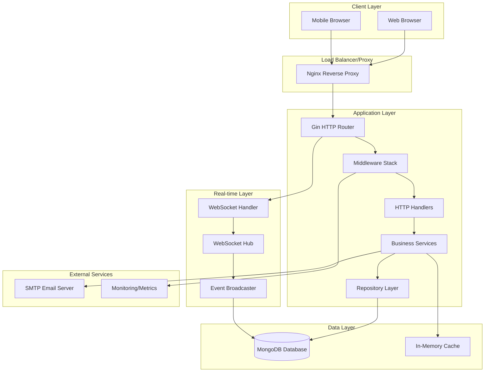
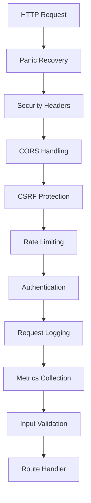
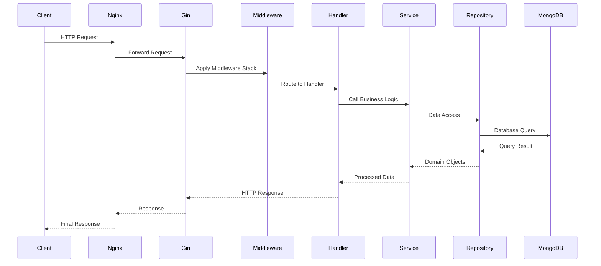
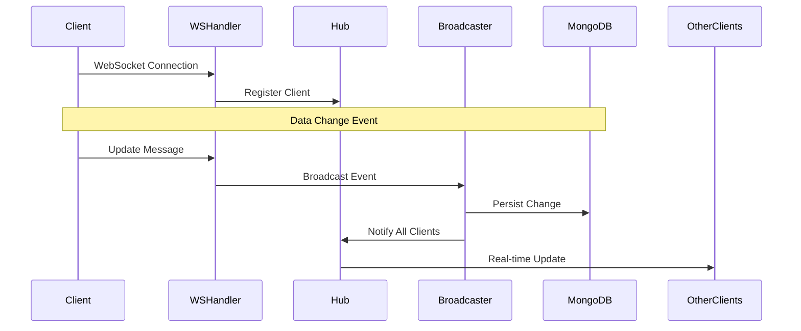
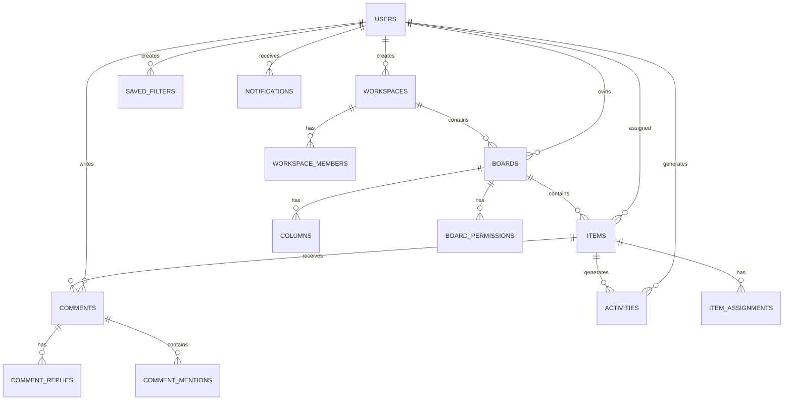
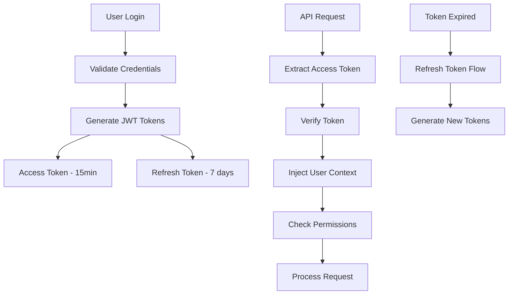
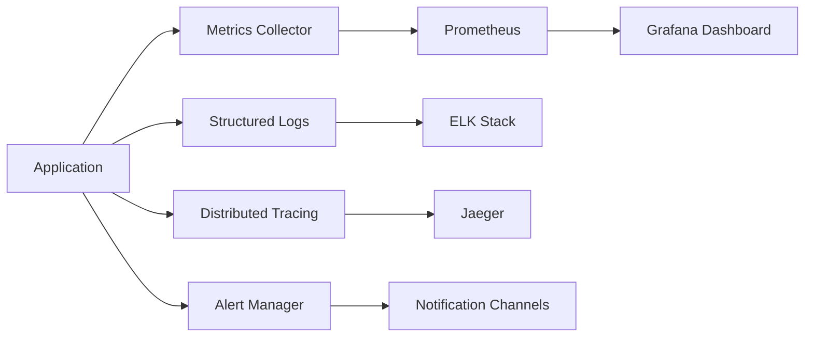
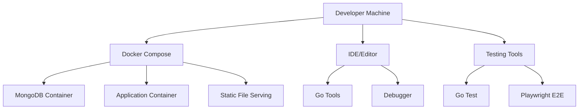
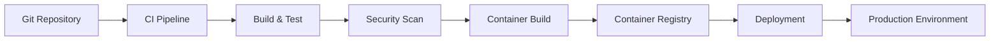

# Project Management Platform - Architecture

## System Architecture Overview

The project management platform follows a **layered monolithic architecture** with clear separation between presentation, business logic, and data layers. The system is designed for scalability, maintainability, and security.

## High-Level Architecture

## Layer Responsibilities

### 1. Presentation Layer (HTTP Handlers)

**Location**: `internal/handlers/`

Responsibilities:
- HTTP request/response handling
- Input validation and sanitization
- Authentication/authorization checks
- Response formatting
- Error handling and status codes

Key handlers:
- `AuthHandler` - Authentication operations
- `BoardHandler` - Board management
- `ItemHandler` - Item CRUD operations
- `WorkspaceHandler` - Workspace management
- `CommentHandler` - Comments and discussions

### 2. Business Logic Layer (Services)

**Location**: `internal/services/`

Responsibilities:
- Core business logic implementation
- Data validation and transformation
- Inter-service communication
- Transaction management
- Business rule enforcement

Key services:
- `AuthService` - User authentication and JWT management
- `BoardService` - Board operations and permissions
- `ItemService` - Item lifecycle management
- `WorkspaceService` - Workspace operations
- `EmailService` - Email notifications
- `SearchService` - Full-text search functionality
- `FilterService` - Advanced filtering logic

### 3. Data Access Layer (Repositories)

**Location**: `internal/repository/`

Responsibilities:
- Database query abstraction
- Data mapping and transformation
- Connection pool management
- Query optimization
- Database-specific logic

Key repositories:
- `UserRepository` - User data operations
- `BoardRepository` - Board persistence
- `ItemRepository` - Item data access
- `WorkspaceRepository` - Workspace data
- `CommentRepository` - Comment storage
- `ActivityRepository` - Activity logging

## Middleware Stack

The application uses a comprehensive middleware stack for cross-cutting concerns:

### Middleware Components

1. **Security Middleware**
   - HTTPS redirect (production)
   - HSTS headers
   - Security headers (X-Frame-Options, X-Content-Type-Options, etc.)
   - Content Security Policy
   - Input sanitization

2. **Authentication Middleware**
   - JWT token validation
   - User context injection
   - Permission checking
   - Session management

3. **Rate Limiting Middleware**
   - Per-IP rate limiting
   - Per-user rate limiting
   - Endpoint-specific limits
   - Burst capacity handling

4. **Monitoring Middleware**
   - Request ID generation
   - Structured logging
   - Performance metrics
   - Error tracking

## Data Flow Architecture

### 1. Request Processing Flow

### 2. WebSocket Real-time Flow

## Database Architecture

### MongoDB Collections Structure

### Collection Indexes

Key indexes for performance optimization:

1. **Users Collection**
   - `email` (unique)
   - `username` (unique)
   - `created_at`

2. **Boards Collection**
   - `workspace_id`
   - `owner_id`
   - `created_at`
   - `updated_at`

3. **Items Collection**
   - `board_id`
   - `assigned_to`
   - `status`
   - `priority`
   - `created_at`
   - Text index on `title` and `description`

4. **Activities Collection**
   - `user_id`
   - `board_id`
   - `item_id`
   - `created_at`
   - Compound index on `board_id` + `created_at`

## Security Architecture

### Authentication & Authorization

### Security Layers

1. **Transport Security**
   - HTTPS enforcement
   - TLS 1.2+ requirement
   - HSTS headers

2. **Input Security**
   - Input validation
   - SQL injection prevention
   - XSS protection
   - CSRF tokens

3. **Authentication Security**
   - JWT with short expiration
   - Refresh token rotation
   - Password hashing (bcrypt)
   - Rate limiting on auth endpoints

4. **Authorization Security**
   - Role-based access control
   - Resource-level permissions
   - Workspace isolation
   - API endpoint protection

## Scalability Considerations

### Current Architecture Scalability

1. **Horizontal Scaling**
   - Stateless application design
   - Session-less JWT authentication
   - Database connection pooling
   - Load balancer ready

2. **Vertical Scaling**
   - Efficient memory usage
   - Connection pool optimization
   - Query optimization
   - Caching strategies

3. **Database Scaling**
   - MongoDB replica sets
   - Read preference configuration
   - Index optimization
   - Sharding preparation

### Future Scaling Strategies

1. **Microservices Migration**
   - Service extraction by domain
   - API gateway implementation
   - Service mesh adoption
   - Distributed tracing

2. **Caching Layer**
   - Redis integration
   - Application-level caching
   - Database query caching
   - CDN for static assets

3. **Message Queue Integration**
   - Asynchronous processing
   - Event-driven architecture
   - Background job processing
   - Real-time event streaming

## Monitoring & Observability

### Metrics Collection

### Key Metrics

1. **Application Metrics**
   - Request rate and latency
   - Error rates by endpoint
   - Active user sessions
   - WebSocket connections

2. **Business Metrics**
   - User registrations
   - Board creations
   - Item completions
   - Collaboration events

3. **Infrastructure Metrics**
   - CPU and memory usage
   - Database connection pool
   - Response times
   - Error rates

## Development Architecture

### Local Development Setup

### CI/CD Pipeline Architecture

This architecture provides a solid foundation for a scalable, maintainable, and secure project management platform while maintaining simplicity and developer productivity.
