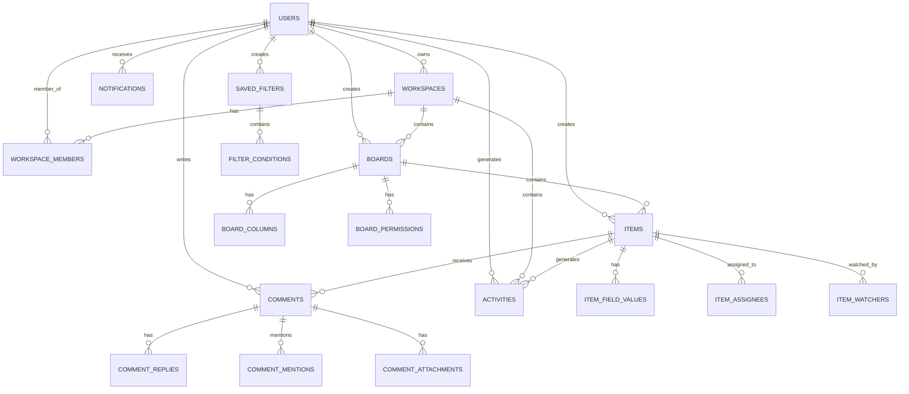

# Project Management Platform - Data Models

## Overview

The project management platform uses **MongoDB** as its primary database with a well-structured document-based data model. The system is designed around core entities: Users, Workspaces, Boards, Items, Comments, Activities, and Notifications, with rich relationships and comprehensive indexing for performance.

## Database Architecture

### Entity Relationship Diagram



## Core Data Models

### 1. User Model

**Collection**: `users`

```go
type User struct {
    ID            primitive.ObjectID `bson:"_id,omitempty" json:"id"`
    Email         string             `bson:"email" json:"email"`
    Password      string             `bson:"password" json:"-"`
    FirstName     string             `bson:"firstName" json:"firstName"`
    LastName      string             `bson:"lastName" json:"lastName"`
    Avatar        string             `bson:"avatar,omitempty" json:"avatar,omitempty"`
    EmailVerified bool               `bson:"emailVerified" json:"emailVerified"`
    CreatedAt     time.Time          `bson:"createdAt" json:"createdAt"`
    UpdatedAt     time.Time          `bson:"updatedAt" json:"updatedAt"`
    LastLoginAt   *time.Time         `bson:"lastLoginAt,omitempty" json:"lastLoginAt,omitempty"`
    Preferences   UserPreferences    `bson:"preferences" json:"preferences"`
}

type UserPreferences struct {
    Theme         string                    `bson:"theme" json:"theme"`
    Notifications UserNotificationSettings `bson:"notifications" json:"notifications"`
}

type UserNotificationSettings struct {
    Email       bool `bson:"email" json:"email"`
    Push        bool `bson:"push" json:"push"`
    Mentions    bool `bson:"mentions" json:"mentions"`
    Comments    bool `bson:"comments" json:"comments"`
    Assignments bool `bson:"assignments" json:"assignments"`
    Updates     bool `bson:"updates" json:"updates"`
}
```

**Key Features**:
- **Security**: Password field excluded from JSON serialization
- **Verification**: Email verification status tracking
- **Preferences**: User customization settings
- **Activity Tracking**: Login timestamp tracking

**Indexes**:
- `email` (unique)
- `createdAt`
- `lastLoginAt`

### 2. Workspace Model

**Collection**: `workspaces`

```go
type Workspace struct {
    ID          primitive.ObjectID  `bson:"_id,omitempty" json:"id"`
    Name        string              `bson:"name" json:"name"`
    Description string              `bson:"description,omitempty" json:"description,omitempty"`
    Logo        string              `bson:"logo,omitempty" json:"logo,omitempty"`
    OwnerID     primitive.ObjectID  `bson:"ownerId" json:"ownerId"`
    Members     []WorkspaceMember   `bson:"members" json:"members"`
    Settings    WorkspaceSettings   `bson:"settings" json:"settings"`
    CreatedAt   time.Time           `bson:"createdAt" json:"createdAt"`
    UpdatedAt   time.Time           `bson:"updatedAt" json:"updatedAt"`
}

type WorkspaceMember struct {
    UserID   primitive.ObjectID `bson:"userId" json:"userId"`
    Role     string             `bson:"role" json:"role"` // 'admin', 'member'
    JoinedAt time.Time          `bson:"joinedAt" json:"joinedAt"`
}

type WorkspaceSettings struct {
    Visibility   string `bson:"visibility" json:"visibility"` // 'private', 'public'
    AllowInvites bool   `bson:"allowInvites" json:"allowInvites"`
}
```

**Key Features**:
- **Multi-tenancy**: Isolated workspaces for organizations
- **Role-based Access**: Admin and member roles
- **Membership Management**: Embedded member documents
- **Configurable Settings**: Visibility and invitation controls

**Indexes**:
- `ownerId`
- `members.userId`
- `createdAt`

### 3. Board Model

**Collection**: `boards`

```go
type Board struct {
    ID          primitive.ObjectID `bson:"_id,omitempty" json:"id"`
    Name        string             `bson:"name" json:"name"`
    Description string             `bson:"description,omitempty" json:"description,omitempty"`
    WorkspaceID primitive.ObjectID `bson:"workspaceId" json:"workspaceId"`
    Color       string             `bson:"color,omitempty" json:"color,omitempty"`
    Columns     []BoardColumn      `bson:"columns" json:"columns"`
    Permissions []BoardPermission  `bson:"permissions,omitempty" json:"permissions,omitempty"`
    Settings    BoardSettings      `bson:"settings" json:"settings"`
    CreatedAt   time.Time          `bson:"createdAt" json:"createdAt"`
    UpdatedAt   time.Time          `bson:"updatedAt" json:"updatedAt"`
    CreatedBy   primitive.ObjectID `bson:"createdBy" json:"createdBy"`
}

type BoardColumn struct {
    ID       string                 `bson:"id" json:"id"`
    Name     string                 `bson:"name" json:"name"`
    Type     string                 `bson:"type" json:"type"` // 'text', 'status', 'date', 'number', 'person'
    Settings map[string]interface{} `bson:"settings,omitempty" json:"settings,omitempty"`
    Position int                    `bson:"position" json:"position"`
    CreatedAt time.Time             `bson:"createdAt" json:"createdAt"`
    UpdatedAt time.Time             `bson:"updatedAt" json:"updatedAt"`
}

type BoardPermission struct {
    UserID      primitive.ObjectID `bson:"userId" json:"userId"`
    Permission  string             `bson:"permission" json:"permission"` // 'read', 'write', 'admin'
    GrantedAt   time.Time          `bson:"grantedAt" json:"grantedAt"`
    GrantedBy   primitive.ObjectID `bson:"grantedBy" json:"grantedBy"`
}
```

**Key Features**:
- **Flexible Columns**: Multiple column types (text, status, date, number, person)
- **Granular Permissions**: User-level board access control
- **Customizable Settings**: Board-specific configuration
- **Visual Customization**: Color theming support

**Indexes**:
- `workspaceId`
- `createdBy`
- `permissions.userId`
- `createdAt`

### 4. Item Model

**Collection**: `items`

```go
type Item struct {
    ID          primitive.ObjectID   `bson:"_id,omitempty" json:"id"`
    Name        string               `bson:"name" json:"name"`
    BoardID     primitive.ObjectID   `bson:"boardId" json:"boardId"`
    Position    int                  `bson:"position" json:"position"`
    FieldValues []ItemFieldValue     `bson:"fieldValues" json:"fieldValues"`
    Assignees   []primitive.ObjectID `bson:"assignees,omitempty" json:"assignees,omitempty"`
    Watchers    []primitive.ObjectID `bson:"watchers,omitempty" json:"watchers,omitempty"`
    CreatedAt   time.Time            `bson:"createdAt" json:"createdAt"`
    UpdatedAt   time.Time            `bson:"updatedAt" json:"updatedAt"`
    CreatedBy   primitive.ObjectID   `bson:"createdBy" json:"createdBy"`
}

type ItemFieldValue struct {
    ColumnID  string             `bson:"columnId" json:"columnId"`
    Value     interface{}        `bson:"value" json:"value"`
    UpdatedAt time.Time          `bson:"updatedAt" json:"updatedAt"`
    UpdatedBy primitive.ObjectID `bson:"updatedBy" json:"updatedBy"`
}
```

**Key Features**:
- **Dynamic Fields**: Field values correspond to board columns
- **Assignment System**: Multiple assignees per item
- **Watch System**: Users can watch items for notifications
- **Positioning**: Ordered items within boards
- **Audit Trail**: Field-level update tracking

**Indexes**:
- `boardId`
- `assignees`
- `watchers`
- `createdBy`
- `createdAt`
- Text index on `name`

### 5. Comment Model

**Collection**: `comments`

```go
type Comment struct {
    ID          primitive.ObjectID   `bson:"_id,omitempty" json:"id"`
    Content     string               `bson:"content" json:"content"`
    ItemID      primitive.ObjectID   `bson:"itemId" json:"itemId"`
    AuthorID    primitive.ObjectID   `bson:"authorId" json:"authorId"`
    ParentID    *primitive.ObjectID  `bson:"parentId,omitempty" json:"parentId,omitempty"`
    Mentions    []primitive.ObjectID `bson:"mentions,omitempty" json:"mentions,omitempty"`
    Attachments []CommentAttachment  `bson:"attachments,omitempty" json:"attachments,omitempty"`
    CreatedAt   time.Time            `bson:"createdAt" json:"createdAt"`
    UpdatedAt   time.Time            `bson:"updatedAt" json:"updatedAt"`
    EditedAt    *time.Time           `bson:"editedAt,omitempty" json:"editedAt,omitempty"`
}

type CommentAttachment struct {
    Filename    string    `bson:"filename" json:"filename"`
    URL         string    `bson:"url" json:"url"`
    Size        int64     `bson:"size" json:"size"`
    ContentType string    `bson:"contentType" json:"contentType"`
    UploadedAt  time.Time `bson:"uploadedAt" json:"uploadedAt"`
}
```

**Key Features**:
- **Threaded Comments**: Parent-child relationship support
- **User Mentions**: @mention functionality
- **File Attachments**: Document and image support
- **Edit History**: Edit timestamp tracking

**Indexes**:
- `itemId`
- `authorId`
- `parentId`
- `mentions`
- `createdAt`

### 6. Activity Model

**Collection**: `activities`

```go
type Activity struct {
    ID          primitive.ObjectID     `bson:"_id,omitempty" json:"id"`
    Type        string                 `bson:"type" json:"type"`
    EntityType  string                 `bson:"entityType" json:"entityType"`
    EntityID    primitive.ObjectID     `bson:"entityId" json:"entityId"`
    UserID      primitive.ObjectID     `bson:"userId" json:"userId"`
    Data        map[string]interface{} `bson:"data,omitempty" json:"data,omitempty"`
    WorkspaceID primitive.ObjectID     `bson:"workspaceId" json:"workspaceId"`
    BoardID     *primitive.ObjectID    `bson:"boardId,omitempty" json:"boardId,omitempty"`
    ItemID      *primitive.ObjectID    `bson:"itemId,omitempty" json:"itemId,omitempty"`
    CreatedAt   time.Time              `bson:"createdAt" json:"createdAt"`
}
```

**Activity Types**:
- `item_created`, `item_updated`, `item_deleted`
- `comment_added`, `comment_updated`, `comment_deleted`
- `board_created`, `board_updated`, `board_deleted`
- `workspace_created`, `workspace_updated`
- `user_assigned`, `user_unassigned`
- `permission_granted`, `permission_revoked`

**Key Features**:
- **Comprehensive Audit**: All system actions logged
- **Flexible Data**: Action-specific metadata in data field
- **Multi-level Context**: Workspace, board, and item context
- **Time-series Data**: Chronological activity tracking

**Indexes**:
- `workspaceId` + `createdAt` (compound)
- `userId` + `createdAt` (compound)
- `entityType` + `entityId` (compound)
- `boardId`
- `itemId`

### 7. Notification Model

**Collection**: `notifications`

```go
type Notification struct {
    ID          primitive.ObjectID     `bson:"_id,omitempty" json:"id"`
    Type        string                 `bson:"type" json:"type"`
    Title       string                 `bson:"title" json:"title"`
    Message     string                 `bson:"message" json:"message"`
    UserID      primitive.ObjectID     `bson:"userId" json:"userId"`
    EntityType  string                 `bson:"entityType,omitempty" json:"entityType,omitempty"`
    EntityID    *primitive.ObjectID    `bson:"entityId,omitempty" json:"entityId,omitempty"`
    Data        map[string]interface{} `bson:"data,omitempty" json:"data,omitempty"`
    Read        bool                   `bson:"read" json:"read"`
    ReadAt      *time.Time             `bson:"readAt,omitempty" json:"readAt,omitempty"`
    EmailSent   bool                   `bson:"emailSent" json:"emailSent"`
    EmailSentAt *time.Time             `bson:"emailSentAt,omitempty" json:"emailSentAt,omitempty"`
    CreatedAt   time.Time              `bson:"createdAt" json:"createdAt"`
}
```

**Notification Types**:
- `mention` - User mentioned in comment
- `assignment` - User assigned to item
- `comment` - New comment on watched item
- `board_invitation` - Invited to board
- `workspace_invitation` - Invited to workspace

**Key Features**:
- **Multi-channel**: In-app and email notifications
- **Read Tracking**: Read status and timestamp
- **Entity Linking**: Links to related entities
- **Email Integration**: Email delivery tracking

**Indexes**:
- `userId` + `read` (compound)
- `userId` + `createdAt` (compound)
- `emailSent` + `createdAt` (compound)

### 8. Saved Filter Model

**Collection**: `saved_filters`

```go
type SavedFilter struct {
    ID          primitive.ObjectID `bson:"_id,omitempty" json:"id"`
    Name        string             `bson:"name" json:"name"`
    Description string             `bson:"description,omitempty" json:"description,omitempty"`
    UserID      primitive.ObjectID `bson:"userId" json:"userId"`
    WorkspaceID primitive.ObjectID `bson:"workspaceId" json:"workspaceId"`
    EntityType  string             `bson:"entityType" json:"entityType"`
    Query       FilterQuery        `bson:"query" json:"query"`
    IsPublic    bool               `bson:"isPublic" json:"isPublic"`
    UsageCount  int64              `bson:"usageCount" json:"usageCount"`
    CreatedAt   time.Time          `bson:"createdAt" json:"createdAt"`
    UpdatedAt   time.Time          `bson:"updatedAt" json:"updatedAt"`
}

type FilterQuery struct {
    Logic      FilterLogic       `json:"logic"`
    Conditions []FilterCondition `json:"conditions,omitempty"`
    Groups     []FilterGroup     `json:"groups,omitempty"`
}

type FilterCondition struct {
    Field    string        `json:"field"`
    Operator FilterOperator `json:"operator"`
    Value    interface{}   `json:"value"`
}
```

**Key Features**:
- **Complex Queries**: Nested conditions with AND/OR logic
- **Reusable Filters**: Save and share common filter patterns
- **Usage Analytics**: Track filter popularity
- **Public/Private**: Share filters within workspace

## Database Operations

### Connection Management

```go
// Database client initialization
func NewClient(uri string) (*mongo.Client, error) {
    // URI validation
    u, err := url.Parse(uri)
    if err != nil {
        return nil, fmt.Errorf("invalid MongoDB URI: %w", err)
    }
    
    // Connection options
    opts := options.Client().ApplyURI(uri)
    
    // Create client with timeout
    ctx, cancel := context.WithTimeout(context.Background(), 10*time.Second)
    defer cancel()
    
    client, err := mongo.Connect(ctx, opts)
    if err != nil {
        return nil, fmt.Errorf("failed to connect: %w", err)
    }
    
    // Verify connection
    if err := client.Ping(ctx, nil); err != nil {
        return nil, fmt.Errorf("failed to ping: %w", err)
    }
    
    return client, nil
}
```

### Repository Pattern

The application uses the repository pattern for data access abstraction:

```go
type UserRepository interface {
    Create(ctx context.Context, user *models.User) (*mongo.InsertOneResult, error)
    GetByID(ctx context.Context, id primitive.ObjectID) (*models.User, error)
    GetByEmail(ctx context.Context, email string) (*models.User, error)
    Update(ctx context.Context, id primitive.ObjectID, update bson.M) (*mongo.UpdateResult, error)
    Delete(ctx context.Context, id primitive.ObjectID) (*mongo.DeleteResult, error)
    // ... more methods
}
```

### Index Strategy

#### Performance Indexes
```javascript
// Users collection
db.users.createIndex({ "email": 1 }, { unique: true })
db.users.createIndex({ "createdAt": 1 })
db.users.createIndex({ "lastLoginAt": 1 })

// Workspaces collection
db.workspaces.createIndex({ "ownerId": 1 })
db.workspaces.createIndex({ "members.userId": 1 })

// Boards collection
db.boards.createIndex({ "workspaceId": 1 })
db.boards.createIndex({ "createdBy": 1 })
db.boards.createIndex({ "permissions.userId": 1 })

// Items collection
db.items.createIndex({ "boardId": 1 })
db.items.createIndex({ "assignees": 1 })
db.items.createIndex({ "watchers": 1 })
db.items.createIndex({ "name": "text" }) // Full-text search

// Comments collection
db.comments.createIndex({ "itemId": 1 })
db.comments.createIndex({ "authorId": 1 })
db.comments.createIndex({ "parentId": 1 })

// Activities collection
db.activities.createIndex({ "workspaceId": 1, "createdAt": -1 })
db.activities.createIndex({ "userId": 1, "createdAt": -1 })
db.activities.createIndex({ "entityType": 1, "entityId": 1 })

// Notifications collection
db.notifications.createIndex({ "userId": 1, "read": 1 })
db.notifications.createIndex({ "userId": 1, "createdAt": -1 })
db.notifications.createIndex({ "emailSent": 1, "createdAt": 1 })
```

## Data Validation

### Model-level Validation

Each model includes comprehensive validation:

```go
func (w *Workspace) Validate() error {
    if w.Name == "" {
        return fmt.Errorf("workspace name is required")
    }
    
    if len(w.Name) > 100 {
        return fmt.Errorf("workspace name must be less than 100 characters")
    }
    
    if w.OwnerID.IsZero() {
        return fmt.Errorf("workspace owner ID is required")
    }
    
    // Validate members
    for i, member := range w.Members {
        if member.UserID.IsZero() {
            return fmt.Errorf("member %d: user ID is required", i)
        }
        
        if member.Role != WorkspaceRoleAdmin && member.Role != WorkspaceRoleMember {
            return fmt.Errorf("member %d: invalid role: %s", i, member.Role)
        }
    }
    
    return nil
}
```

### Database Constraints

```javascript
// Unique constraints
db.users.createIndex({ "email": 1 }, { unique: true })

// Validation rules (MongoDB schema validation)
db.createCollection("users", {
    validator: {
        $jsonSchema: {
            bsonType: "object",
            required: ["email", "firstName", "lastName", "createdAt"],
            properties: {
                email: {
                    bsonType: "string",
                    pattern: "^[a-zA-Z0-9._%+-]+@[a-zA-Z0-9.-]+\\.[a-zA-Z]{2,}$"
                },
                firstName: {
                    bsonType: "string",
                    minLength: 1,
                    maxLength: 50
                },
                lastName: {
                    bsonType: "string", 
                    minLength: 1,
                    maxLength: 50
                }
            }
        }
    }
})
```

## Performance Considerations

### Query Optimization

1. **Use Compound Indexes**: For multi-field queries
2. **Projection**: Only fetch required fields
3. **Pagination**: Implement limit/skip for large datasets
4. **Aggregation**: Use aggregation pipeline for complex queries

### Example Optimized Query

```go
// Efficient user activity query with projection and pagination
func (r *ActivityRepository) GetByUserID(ctx context.Context, userID primitive.ObjectID, limit, skip int64) ([]*models.Activity, error) {
    filter := bson.M{"userId": userID}
    opts := options.Find().
        SetSort(bson.D{{Key: "createdAt", Value: -1}}).
        SetLimit(limit).
        SetSkip(skip).
        SetProjection(bson.M{
            "type": 1,
            "entityType": 1,
            "entityId": 1,
            "data": 1,
            "createdAt": 1,
        })
    
    cursor, err := r.collection.Find(ctx, filter, opts)
    if err != nil {
        return nil, err
    }
    defer cursor.Close(ctx)
    
    var activities []*models.Activity
    if err := cursor.All(ctx, &activities); err != nil {
        return nil, err
    }
    
    return activities, nil
}
```

## Backup and Recovery

### Backup Strategy

```bash
# Full database backup
mongodump --uri="mongodb://localhost:27017/project_management" --out="/backup/$(date +%Y%m%d)"

# Collection-specific backup
mongodump --uri="mongodb://localhost:27017/project_management" --collection=users --out="/backup/users"

# Restore from backup
mongorestore --uri="mongodb://localhost:27017/project_management" "/backup/20240101"
```

### Data Retention Policies

```javascript
// Create TTL index for automatic cleanup
db.activities.createIndex(
    { "createdAt": 1 }, 
    { expireAfterSeconds: 7776000 } // 90 days
)

db.notifications.createIndex(
    { "createdAt": 1 }, 
    { expireAfterSeconds: 2592000 } // 30 days
)
```

This comprehensive data model provides a solid foundation for the project management platform with proper relationships, indexing, validation, and performance optimization.
