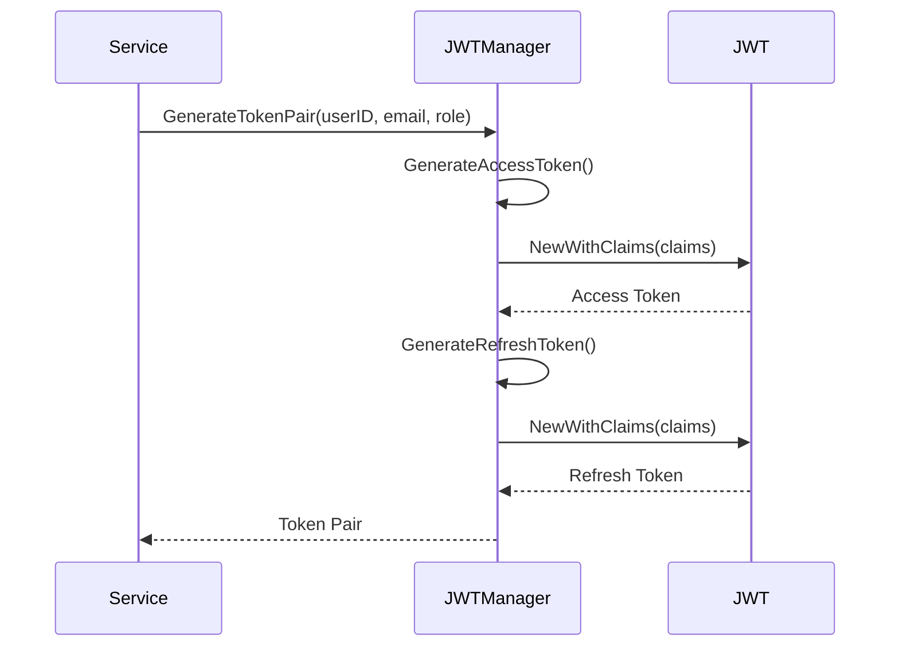
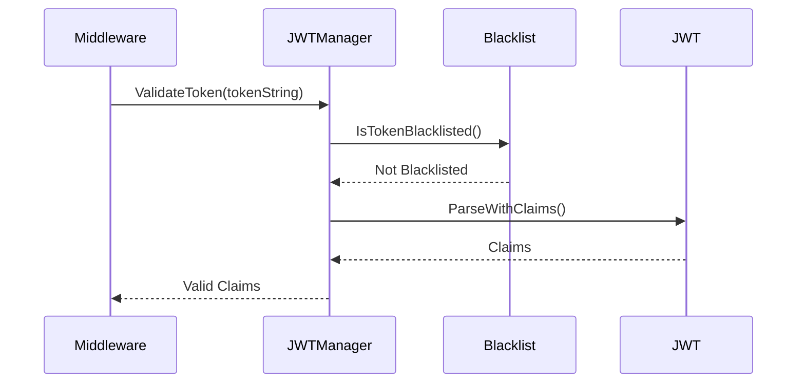

# internal/auth/jwt.go

## File Overview

JWT (JSON Web Token) management module that handles creation, validation, and lifecycle management of authentication tokens. Implements a dual-token system with short-lived access tokens and longer-lived refresh tokens, plus token blacklisting for secure logout functionality.

## Key Components

### JWT Manager Structure
```go
type JWTManager struct {
    secretKey            []byte
    accessTokenDuration  time.Duration
    refreshTokenDuration time.Duration
    blacklistedTokens    map[string]time.Time
}
```
- **Purpose**: Central JWT token operations manager
- **Token Types**: Access tokens (15min) and refresh tokens (7 days)
- **Security**: Token blacklisting for logout functionality
- **Production Note**: Blacklist should use Redis or database in production

### Claims Structure
```go
type Claims struct {
    UserID    primitive.ObjectID `json:"user_id"`
    Email     string             `json:"email"`
    Role      string             `json:"role,omitempty"`
    TokenType string             `json:"token_type"` // "access" or "refresh"
    jwt.RegisteredClaims
}
```
- **User Identity**: MongoDB ObjectID, email, and role
- **Token Type**: Distinguishes between access and refresh tokens
- **Standard Claims**: Expiration, issued at, not before, subject

## Dependencies

### External Libraries
- `github.com/golang-jwt/jwt/v5` - JWT token operations
- `go.mongodb.org/mongo-driver/bson/primitive` - MongoDB ObjectID support

### Standard Libraries
- `errors` - Custom error definitions
- `strings` - String manipulation for test tokens
- `time` - Token expiration handling

## Data Flow

### Token Generation Process


### Token Validation Process


## Interactions

### Core Methods

#### 1. Token Generation
```go
func (j *JWTManager) GenerateTokenPair(userID primitive.ObjectID, email, role string) (accessToken, refreshToken string, err error)
```
- **Purpose**: Creates both access and refresh tokens simultaneously
- **Access Token**: Short-lived (15 minutes) for API requests
- **Refresh Token**: Long-lived (7 days) for token renewal
- **Claims**: Includes user ID, email, role, and token type

#### 2. Token Validation
```go
func (j *JWTManager) ValidateToken(tokenString string) (*Claims, error)
```
- **Blacklist Check**: Verifies token isn't blacklisted
- **Signature Verification**: Validates HMAC signature
- **Expiration Check**: Ensures token hasn't expired
- **Claims Extraction**: Returns structured claims data
- **Test Token Support**: Special handling for development test tokens

#### 3. Token Refresh
```go
func (j *JWTManager) RefreshAccessToken(refreshTokenString string) (string, error)
```
- **Refresh Validation**: Ensures token is valid and type is "refresh"
- **New Access Token**: Generates new access token with existing claims
- **Security**: Maintains user session without re-authentication

#### 4. Token Blacklisting
```go
func (j *JWTManager) BlacklistToken(tokenString string) error
```
- **Logout Security**: Prevents token reuse after logout
- **Expiration-based**: Tokens removed from blacklist after natural expiration
- **Invalid Token Handling**: Blacklists even invalid tokens for security

### Security Features

#### Development Test Tokens
```go
// Handle test tokens for development
if strings.HasPrefix(tokenString, "test-jwt-token-") {
    userIDStr := strings.TrimPrefix(tokenString, "test-jwt-token-")
    // Generate test claims for development
}
```
- **Development Only**: Special token format for testing
- **User ID Extraction**: Extracts user ID from token suffix
- **Test Claims**: Provides valid claims structure for development

#### Token Blacklist Management
```go
func (j *JWTManager) CleanupExpiredBlacklistedTokens() {
    now := time.Now()
    for token, expiration := range j.blacklistedTokens {
        if now.After(expiration) {
            delete(j.blacklistedTokens, token)
        }
    }
}
```
- **Memory Management**: Removes expired tokens from blacklist
- **Automatic Cleanup**: Should be called periodically
- **Performance**: Prevents memory leaks in long-running applications

## Example Usage

### Token Generation
```go
jwtManager := auth.NewJWTManager(
    "your-secret-key-at-least-32-chars",
    15*time.Minute,  // Access token duration
    168*time.Hour,   // Refresh token duration (7 days)
)

userID, _ := primitive.ObjectIDFromHex("507f1f77bcf86cd799439011")
accessToken, refreshToken, err := jwtManager.GenerateTokenPair(
    userID,
    "user@example.com",
    "user",
)
```

### Token Validation
```go
claims, err := jwtManager.ValidateToken(accessToken)
if err != nil {
    switch err {
    case auth.ErrExpiredToken:
        // Handle token expiration
    case auth.ErrInvalidToken:
        // Handle invalid token
    case auth.ErrTokenClaims:
        // Handle malformed claims
    }
}

// Use validated claims
userID := claims.UserID
email := claims.Email
role := claims.Role
```

### Token Refresh
```go
newAccessToken, err := jwtManager.RefreshAccessToken(refreshToken)
if err != nil {
    // Refresh token invalid or expired
    // Require user to log in again
}
```

### Secure Logout
```go
// Blacklist both tokens on logout
err1 := jwtManager.BlacklistToken(accessToken)
err2 := jwtManager.BlacklistToken(refreshToken)
```

## Error Handling

### Custom Errors
```go
var (
    ErrInvalidToken = errors.New("invalid token")
    ErrExpiredToken = errors.New("token has expired")
    ErrTokenClaims  = errors.New("invalid token claims")
)
```

### Error Classification
- **ErrInvalidToken**: Malformed token, invalid signature, or blacklisted
- **ErrExpiredToken**: Token past expiration time
- **ErrTokenClaims**: Valid token but invalid claims structure

### Error Handling Pattern
```go
claims, err := jwtManager.ValidateToken(token)
if err != nil {
    if errors.Is(err, jwt.ErrTokenExpired) {
        return auth.ErrExpiredToken
    }
    return auth.ErrInvalidToken
}
```

## Security Considerations

### Secret Key Management
- **Minimum Length**: 32 characters required
- **Environment Variables**: Should be loaded from secure configuration
- **Production**: Must be changed from default value
- **Rotation**: Consider periodic key rotation for high-security environments

### Token Expiration Strategy
- **Short Access Tokens**: 15 minutes reduces exposure window
- **Longer Refresh Tokens**: 7 days balances security and usability
- **Configurable**: Durations can be adjusted based on security requirements

### Signature Security
- **HMAC-SHA256**: Industry-standard signing algorithm
- **Signature Verification**: All tokens verified before trust
- **Algorithm Validation**: Prevents algorithm substitution attacks

### Blacklist Security
- **Logout Protection**: Prevents token reuse after logout
- **Memory Considerations**: In-memory blacklist suitable for single instance
- **Production Scaling**: Should use Redis or database for multi-instance deployments
- **Cleanup Strategy**: Automatic removal of expired tokens

## Performance Considerations

### Token Size
- **Minimal Claims**: Only essential user information included
- **Compact Format**: JWT is naturally compact
- **Base64 Encoding**: Standard JWT encoding

### Validation Performance
- **Fast Verification**: HMAC verification is computationally efficient
- **No Database Lookup**: Stateless validation (except blacklist check)
- **Caching Potential**: Claims can be cached for duration of token

### Memory Management
- **Blacklist Growth**: Monitor blacklist size in production
- **Cleanup Frequency**: Balance between memory usage and cleanup overhead
- **Token Reuse**: Encourage proper token lifecycle management

## Production Recommendations

### Blacklist Storage
```go
// Production implementation should use Redis
type RedisBlacklist struct {
    client *redis.Client
}

func (rb *RedisBlacklist) BlacklistToken(token string, expiration time.Time) error {
    return rb.client.Set(token, "blacklisted", time.Until(expiration)).Err()
}
```

### Key Rotation
- **Regular Rotation**: Implement periodic secret key rotation
- **Graceful Transition**: Support multiple keys during rotation period
- **Monitoring**: Log key rotation events for audit

### Monitoring
- **Token Metrics**: Track token generation, validation, and refresh rates
- **Error Monitoring**: Monitor authentication failure patterns
- **Blacklist Size**: Monitor blacklist growth and cleanup effectiveness

This JWT module provides a secure, efficient, and scalable foundation for authentication in the project management platform.
