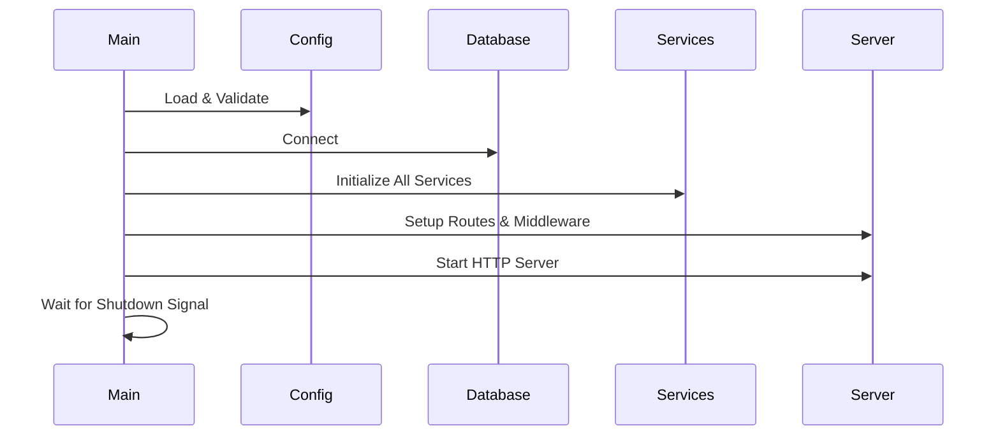

# cmd/server/main.go

## File Overview

The main entry point of the project management platform server application. This file orchestrates the initialization of all system components, sets up the HTTP server with middleware stack, configures routing, and handles graceful shutdown.

## Key Components

### Main Function
- **Purpose**: Application bootstrap and lifecycle management
- **Responsibilities**:
  - Configuration loading and validation
  - Database connection establishment
  - Service initialization and dependency injection
  - HTTP server setup and startup
  - Graceful shutdown handling

### Configuration Management
```go
cfg, err := config.Load()
if err := cfg.Validate(); err != nil
```
- Loads configuration from YAML file and environment variables
- Validates configuration before proceeding
- Exits with error if configuration is invalid

### Database Connection
```go
client, err := database.NewClient(cfg.Database.URI)
defer func() {
    ctx, cancel := context.WithTimeout(context.Background(), 10*time.Second)
    defer cancel()
    if err := client.Disconnect(ctx); err != nil
```
- Establishes MongoDB connection with proper error handling
- Sets up deferred cleanup with timeout context
- Uses database client throughout application lifecycle

### Service Initialization
The application follows a dependency injection pattern:

1. **Core Services**:
   - `JWTManager` - JWT token management
   - `PasswordHasher` - Password hashing utilities
   - `EmailService` - Email notification service

2. **Business Services**:
   - `AuthService` - User authentication
   - `WorkspaceService` - Workspace management
   - `BoardService` - Board operations
   - `ItemService` - Item management
   - `CommentService` - Comments and discussions
   - `ActivityService` - Activity tracking
   - `SearchService` - Search functionality
   - `FilterService` - Advanced filtering
   - `CacheService` - In-memory caching

3. **Infrastructure Services**:
   - `MonitoringService` - Metrics and monitoring
   - `WebSocket Handler` - Real-time communication
   - `Broadcaster` - WebSocket event broadcasting

## Dependencies

### Internal Modules
- `internal/auth` - Authentication and JWT management
- `internal/config` - Configuration loading
- `internal/database` - Database client
- `internal/handlers` - HTTP request handlers
- `internal/logger` - Structured logging
- `internal/middleware` - HTTP middleware
- `internal/monitoring` - Metrics collection
- `internal/repository` - Data access layer
- `internal/security` - Security utilities
- `internal/services` - Business logic
- `internal/websocket` - WebSocket handling

### External Dependencies
- `github.com/gin-gonic/gin` - HTTP router and middleware
- `github.com/go-playground/validator/v10` - Input validation
- `github.com/sirupsen/logrus` - Logging (legacy compatibility)

## Data Flow

### Startup Sequence


### Request Processing Flow
1. **Middleware Stack**: Security, CORS, CSRF, Rate Limiting, Auth, Logging
2. **Routing**: Gin router dispatches to appropriate handler
3. **Handler**: Processes request, calls services
4. **Services**: Execute business logic
5. **Repository**: Data access operations
6. **Response**: JSON response sent back through middleware

## Interactions

### Route Setup (`setupRoutes` function)
- **API Routes**: `/api/*` for REST endpoints
- **Static Routes**: Frontend assets and HTML files
- **WebSocket Routes**: Real-time communication endpoints
- **Health Routes**: Health check endpoints
- **Admin Routes**: Administrative endpoints

### Middleware Configuration
```go
// Security middleware
router.Use(middleware.HTTPSRedirectMiddleware())
router.Use(middleware.HSTSMiddleware())
router.Use(middleware.CORSMiddleware(middleware.DefaultCORSConfig()))
router.Use(middleware.SecurityHeadersMiddleware())

// CSRF and validation
router.Use(middleware.CSRFMiddleware())
router.Use(middleware.ValidationMiddleware())

// Rate limiting
router.Use(middleware.RateLimitMiddleware(middleware.AuthRateLimitConfig{
    RequestsPerMinute: 100,
    BurstSize:         10,
}))
```

### Static File Serving
The application serves a vanilla JavaScript frontend:
```go
// Static assets
router.Static("/css", "frontend/vanilla/css")
router.Static("/js", "frontend/vanilla/js")
router.Static("/assets", "frontend/vanilla/assets")

// HTML pages
router.StaticFile("/boards", "frontend/vanilla/boards.html")
router.StaticFile("/dashboard", "frontend/vanilla/dashboard.html")
```

### WebSocket Integration
```go
// Initialize WebSocket components
websocketHandler := websocket.NewHandler(jwtManager)
broadcaster := websocket.NewBroadcaster(websocketHandler.GetHub(), client)

// Start background services
go websocketHandler.GetHub().Run()
go broadcaster.Start(ctxBroadcaster)
```

## Example Usage

### Server Startup
```bash
# Development
go run ./cmd/server

# Production build
go build -o bin/server ./cmd/server
./bin/server
```

### Configuration
```yaml
# config.yaml
server:
  host: "0.0.0.0"
  port: "8080"
database:
  uri: "mongodb://localhost:27017"
  name: "project_management"
jwt:
  secret: "your-secret-key"
  access_expiration: "15m"
```

### Environment Variables
```bash
export APP_SERVER_PORT=8080
export APP_DATABASE_URI=mongodb://localhost:27017
export APP_JWT_SECRET=your-secret-key
```

## Error Handling

### Startup Errors
- Configuration loading failures exit with status 1
- Database connection failures exit with status 1
- Server startup failures exit with status 1

### Graceful Shutdown
```go
// Wait for interrupt signal
quit := make(chan os.Signal, 1)
signal.Notify(quit, syscall.SIGINT, syscall.SIGTERM)
<-quit

// Graceful shutdown with 30-second timeout
shutdownCtx, shutdownCancel := context.WithTimeout(context.Background(), 30*time.Second)
defer shutdownCancel()

if err := server.Shutdown(shutdownCtx); err != nil {
    structuredLogger.Error("Server forced to shutdown", "error", err)
    os.Exit(1)
}
```

## Security Considerations

### Production Mode
```go
if cfg.Environment == "production" {
    gin.SetMode(gin.ReleaseMode)
    router.Use(middleware.HTTPSRedirectMiddleware())
}
```

### Security Middleware Stack
1. **HTTPS Redirect** (production only)
2. **HSTS Headers** - HTTP Strict Transport Security
3. **CORS Configuration** - Cross-Origin Resource Sharing
4. **Security Headers** - X-Frame-Options, X-Content-Type-Options
5. **CSP** - Content Security Policy
6. **Input Sanitization** - XSS prevention
7. **CSRF Protection** - Cross-Site Request Forgery prevention
8. **Rate Limiting** - DoS protection

## Performance Optimizations

### Connection Pooling
- MongoDB connection pool managed by driver
- Configurable pool size and idle timeout
- Proper connection cleanup on shutdown

### Caching
```go
cacheService := services.NewCacheService(5*time.Minute, 1000)
```
- In-memory cache with TTL
- Configurable size limits
- Used for frequently accessed data

### Monitoring
- Request ID generation for tracing
- Performance metrics collection
- Structured logging for observability
- Prometheus metrics integration

This main.go file serves as the central orchestrator of the entire application, ensuring proper initialization, configuration, and lifecycle management of all system components.
