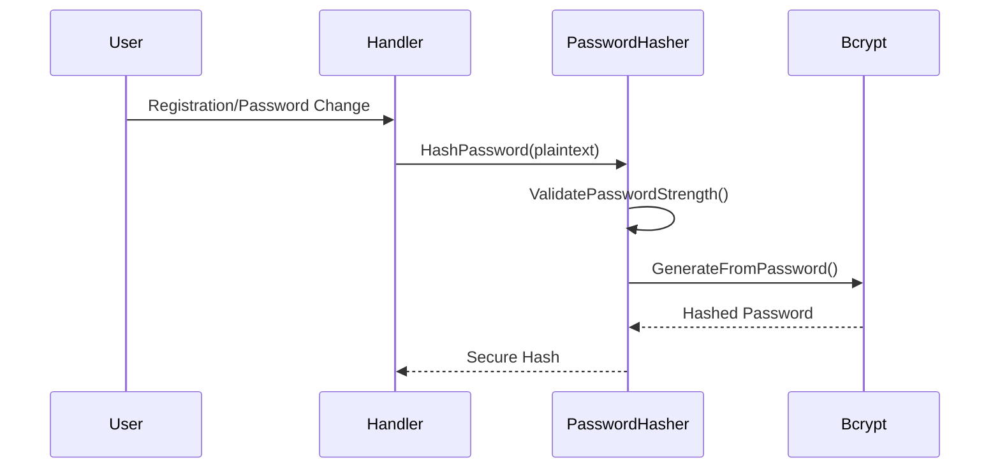
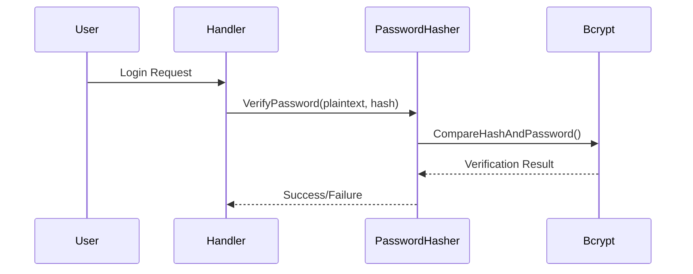

# internal/auth/password.go

## File Overview

Password security module that handles secure password hashing, validation, and strength checking. Implements bcrypt hashing with configurable cost, comprehensive password policy enforcement, and common password detection to ensure strong user authentication security.

## Key Components

### PasswordHasher Structure
```go
type PasswordHasher struct {
    cost int
}
```
- **Purpose**: Centralized password security operations
- **Cost Factor**: Configurable bcrypt cost (default: 12)
- **Security**: Adaptive hashing cost for future-proofing

### Password Policy Constants
```go
const (
    DefaultCost       = 12   // bcrypt cost factor
    MinPasswordLength = 8    // Minimum password length
    MaxPasswordLength = 128  // Maximum password length
)
```
- **Industry Standards**: Follows OWASP password guidelines
- **Reasonable Limits**: Prevents excessively long passwords
- **Configurable Cost**: Allows adjustment for security/performance balance

## Dependencies

### External Libraries
- `golang.org/x/crypto/bcrypt` - Secure password hashing
- `unicode` - Character type validation
- `regexp` - Pattern matching for sanitization

### Standard Libraries
- `errors` - Custom error definitions
- `strings` - String manipulation and case conversion

## Data Flow

### Password Hashing Process


### Password Verification Process


## Interactions

### Core Methods

#### 1. Password Hashing
```go
func (ph *PasswordHasher) HashPassword(password string) (string, error) {
    if err := ph.ValidatePasswordStrength(password); err != nil {
        return "", err
    }
    
    hashedBytes, err := bcrypt.GenerateFromPassword([]byte(password), ph.cost)
    if err != nil {
        return "", err
    }
    
    return string(hashedBytes), nil
}
```
- **Strength Validation**: Ensures password meets policy before hashing
- **Bcrypt Hashing**: Uses configurable cost factor for security
- **Error Handling**: Returns validation errors before attempting hash

#### 2. Password Verification
```go
func (ph *PasswordHasher) VerifyPassword(password, hashedPassword string) error {
    err := bcrypt.CompareHashAndPassword([]byte(hashedPassword), []byte(password))
    if err != nil {
        if errors.Is(err, bcrypt.ErrMismatchedHashAndPassword) {
            return ErrPasswordMismatch
        }
        return err
    }
    return nil
}
```
- **Constant Time**: bcrypt provides timing attack resistance
- **Error Translation**: Converts bcrypt errors to application errors
- **Secure Comparison**: No early returns on mismatch

#### 3. Password Strength Validation
```go
func (ph *PasswordHasher) ValidatePasswordStrength(password string) error {
    // Length validation
    if len(password) < MinPasswordLength {
        return ErrPasswordTooShort
    }
    
    // Character type requirements
    var hasUpper, hasLower, hasNumber, hasSpecial bool
    for _, char := range password {
        switch {
        case unicode.IsUpper(char): hasUpper = true
        case unicode.IsLower(char): hasLower = true  
        case unicode.IsNumber(char): hasNumber = true
        case unicode.IsPunct(char) || unicode.IsSymbol(char): hasSpecial = true
        }
    }
    
    if !hasUpper || !hasLower || !hasNumber || !hasSpecial {
        return ErrPasswordTooWeak
    }
    
    // Common password check
    if ph.isCommonPassword(password) {
        return ErrPasswordTooCommon
    }
    
    return nil
}
```
- **Multi-Factor Validation**: Length, character types, common passwords
- **Unicode Support**: Properly handles international characters
- **Comprehensive Policy**: Meets modern security standards

### Security Features

#### Common Password Detection
```go
func (ph *PasswordHasher) isCommonPassword(password string) bool {
    commonPasswords := []string{
        "password", "123456", "123456789", "12345678", "12345",
        "1234567", "password123", "admin", "qwerty", "abc123",
        // ... more common passwords
    }
    
    lowerPassword := strings.ToLower(password)
    for _, common := range commonPasswords {
        if lowerPassword == common {
            return true
        }
    }
    return false
}
```
- **Case Insensitive**: Prevents simple case variations
- **Curated List**: Common passwords from security breaches
- **Expandable**: Easy to add new common passwords

#### Password Complexity Analysis
```go
func CheckPasswordComplexity(password string) map[string]bool {
    complexity := map[string]bool{
        "min_length":     len(password) >= MinPasswordLength,
        "max_length":     len(password) <= MaxPasswordLength,
        "has_uppercase":  false,
        "has_lowercase":  false,
        "has_number":     false,
        "has_special":    false,
        "not_common":     true,
    }
    // ... character type checking
    return complexity
}
```
- **Detailed Analysis**: Individual requirement checking
- **UI Feedback**: Can be used for real-time password feedback
- **Comprehensive**: All policy requirements covered

## Example Usage

### Password Hashing (Registration)
```go
hasher := auth.NewPasswordHasher()

// Hash password during registration
hashedPassword, err := hasher.HashPassword("MySecurePass123!")
if err != nil {
    switch err {
    case auth.ErrPasswordTooShort:
        // Handle length error
    case auth.ErrPasswordTooWeak:
        // Handle complexity error
    case auth.ErrPasswordTooCommon:
        // Handle common password error
    }
}

// Store hashedPassword in database
user.PasswordHash = hashedPassword
```

### Password Verification (Login)
```go
hasher := auth.NewPasswordHasher()

// Verify password during login
err := hasher.VerifyPassword(loginPassword, user.PasswordHash)
if err != nil {
    if err == auth.ErrPasswordMismatch {
        // Invalid credentials
        return errors.New("invalid email or password")
    }
    // Other error
    return err
}

// Password verified successfully
```

### Password Strength Checking
```go
// Check password complexity for UI feedback
complexity := auth.CheckPasswordComplexity(password)

response := map[string]interface{}{
    "requirements": map[string]bool{
        "min_length":     complexity["min_length"],
        "has_uppercase":  complexity["has_uppercase"],
        "has_lowercase":  complexity["has_lowercase"],
        "has_number":     complexity["has_number"],
        "has_special":    complexity["has_special"],
        "not_common":     complexity["not_common"],
    },
    "is_secure": auth.IsPasswordSecure(password),
}
```

### Custom Cost Configuration
```go
// Higher cost for sensitive applications
hasher := auth.NewPasswordHasherWithCost(14)

// Lower cost for development/testing
hasher := auth.NewPasswordHasherWithCost(10)
```

## Error Handling

### Password-Specific Errors
```go
var (
    ErrPasswordTooShort    = errors.New("password must be at least 8 characters long")
    ErrPasswordTooWeak     = errors.New("password must contain at least one uppercase letter, one lowercase letter, one number, and one special character")
    ErrPasswordTooCommon   = errors.New("password is too common")
    ErrInvalidPassword     = errors.New("invalid password")
    ErrPasswordMismatch    = errors.New("password does not match")
)
```

### Error Response Examples
```json
{
  "success": false,
  "error": {
    "code": "WEAK_PASSWORD",
    "message": "Password must contain at least one uppercase letter, one lowercase letter, one number, and one special character"
  }
}
```

## Security Considerations

### Bcrypt Security
- **Adaptive Cost**: Cost factor 12 provides good security/performance balance
- **Salt Integration**: bcrypt automatically generates and includes salt
- **Future-Proof**: Cost can be increased as hardware improves
- **Timing Attacks**: bcrypt provides inherent timing attack resistance

### Password Policy
- **Minimum Length**: 8 characters minimum (industry standard)
- **Character Diversity**: Requires all character types
- **Common Password Prevention**: Blocks frequently compromised passwords
- **Maximum Length**: 128 characters prevents DoS via long passwords

### Input Sanitization
```go
func SanitizePassword(password string) string {
    // Remove null bytes and control characters
    re := regexp.MustCompile(`[\x00-\x1f\x7f]`)
    return re.ReplaceAllString(password, "")
}
```
- **Control Character Removal**: Prevents injection attacks
- **Null Byte Protection**: Prevents string termination attacks
- **Safe Processing**: Ensures password can be safely processed

## Performance Considerations

### Bcrypt Cost Analysis
- **Cost 10**: ~10ms hashing time, suitable for development
- **Cost 12**: ~50ms hashing time, good production balance
- **Cost 14**: ~200ms hashing time, high security environments
- **Cost 16**: ~800ms hashing time, maximum security

### Optimization Strategies
```go
// Validate format before expensive hashing
if err := ValidatePasswordFormat(password); err != nil {
    return err  // Fast rejection of obviously invalid passwords
}

// Only hash if strength validation passes
if err := hasher.ValidatePasswordStrength(password); err != nil {
    return err  // Avoid expensive hashing for weak passwords
}
```

### Memory Considerations
- **Bcrypt Memory**: bcrypt uses fixed memory regardless of password length
- **Common Password List**: Small memory footprint for common password checking
- **No Caching**: Passwords should never be cached in memory

## Production Recommendations

### Configuration
```go
// Production configuration
hasher := auth.NewPasswordHasherWithCost(12) // Adjust based on hardware

// Development configuration  
hasher := auth.NewPasswordHasherWithCost(10) // Faster for testing
```

### Monitoring
- **Hash Performance**: Monitor hashing duration for performance tuning
- **Failed Attempts**: Track password validation failures
- **Common Passwords**: Monitor attempts to use common passwords

### Security Enhancements
- **Password History**: Prevent reuse of recent passwords
- **Account Lockout**: Implement lockout after failed attempts
- **Breach Detection**: Check passwords against known breach databases
- **Regular Updates**: Update common password list periodically

### Integration with Authentication
```go
// In authentication service
func (s *AuthService) ChangePassword(userID primitive.ObjectID, oldPassword, newPassword string) error {
    // Verify old password
    if err := s.passwordHasher.VerifyPassword(oldPassword, user.PasswordHash); err != nil {
        return errors.New("current password is incorrect")
    }
    
    // Hash new password (includes strength validation)
    hashedPassword, err := s.passwordHasher.HashPassword(newPassword)
    if err != nil {
        return err
    }
    
    // Update user password
    return s.userRepo.UpdatePassword(userID, hashedPassword)
}
```

This password module provides enterprise-grade password security with comprehensive policy enforcement, secure hashing, and performance optimization suitable for production deployment.
