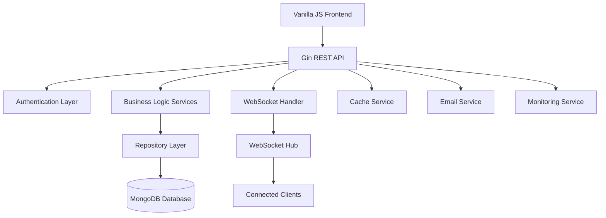

# Project Management Platform - Overview

## Project Purpose

This is a modern, production-grade project management platform similar to Monday.com, built with a **Go backend** using the Gin framework and a **vanilla JavaScript frontend**. The platform provides comprehensive project management capabilities including workspaces, boards, items, real-time collaboration, and advanced filtering/search functionality.

## Architecture Summary

The application follows a **microservices-inspired monolithic architecture** with clear separation of concerns:



## Technology Stack

### Backend (Go)
- **Framework**: Gin (HTTP router/middleware)
- **Database**: MongoDB with official Go driver
- **Authentication**: JWT tokens with refresh mechanism
- **WebSockets**: Gorilla WebSocket for real-time features
- **Configuration**: Koanf (YAML + environment variables)
- **Logging**: Logrus + custom structured logger
- **Validation**: Go Playground Validator
- **Email**: Gomail v2
- **Security**: Rate limiting, CSRF protection, input sanitization

### Frontend (Vanilla JavaScript)
- **Architecture**: Vanilla JavaScript (no frameworks)
- **Styling**: CSS with modern practices
- **Build**: Static file serving through Gin
- **Real-time**: WebSocket client for live updates

### Infrastructure
- **Containerization**: Docker with multi-stage builds
- **Orchestration**: Docker Compose (dev/prod environments)
- **Reverse Proxy**: Nginx (production)
- **Monitoring**: Custom metrics collection with Prometheus integration
- **Testing**: Go testing framework + Playwright for E2E

## Key Features

### Core Functionality
1. **Multi-tenant Workspaces**: Organizations can create isolated workspaces
2. **Kanban Boards**: Visual project management with customizable columns
3. **Items Management**: Tasks/items with rich metadata and relationships
4. **Real-time Collaboration**: Live updates via WebSocket connections
5. **Advanced Search & Filtering**: Full-text search with saved filters
6. **Activity Tracking**: Comprehensive audit trail of all changes
7. **Comments & Mentions**: Threaded discussions with user mentions
8. **Role-based Access Control**: Granular permissions system

### Security Features
- JWT-based authentication with refresh tokens
- CSRF protection
- Rate limiting (per-endpoint and global)
- Input sanitization and validation
- Security headers (HSTS, CSP, etc.)
- Session security middleware
- HTTPS enforcement in production

### Monitoring & Observability
- Health check endpoints (`/health`, `/health/ready`, `/health/live`)
- Prometheus metrics integration
- Structured logging with request tracing
- Performance monitoring middleware
- Alert management system
- Error reporting and tracking

## Project Structure

```
project-management-platform/
├── cmd/                    # Application entry points
│   ├── server/            # Main server application
│   ├── migrate/           # Database migration tool
│   └── verify/            # Verification utilities
├── internal/              # Private application code
│   ├── auth/              # Authentication & JWT management
│   ├── config/            # Configuration management
│   ├── database/          # Database connection & client
│   ├── handlers/          # HTTP request handlers (controllers)
│   ├── middleware/        # HTTP middleware components
│   ├── models/            # Data models and structures
│   ├── repository/        # Data access layer
│   ├── services/          # Business logic layer
│   ├── security/          # Security utilities
│   ├── websocket/         # WebSocket handling
│   └── monitoring/        # Metrics and monitoring
├── frontend/              # Frontend applications
│   ├── vanilla/           # Vanilla JavaScript frontend
│   └── src/               # React frontend (legacy/alternative)
├── config/                # Configuration files
├── docs/                  # Documentation
├── scripts/               # Build and deployment scripts
├── monitoring/            # Monitoring configuration
└── nginx/                 # Nginx configuration
```

## Development Workflow

### Local Development
1. **Prerequisites**: Go 1.24+, Docker, Docker Compose
2. **Database**: MongoDB via Docker Compose
3. **Frontend**: Served as static files through Gin
4. **Hot Reload**: Manual restart required (Go application)
5. **Testing**: Go tests + Playwright E2E tests

### Configuration Management
- **Development**: `config.yaml` + environment variables
- **Production**: Environment variables override defaults
- **Secrets**: JWT secrets, database credentials, SMTP settings
- **Validation**: Configuration validation on startup

### Deployment
- **Development**: `docker-compose.dev.yml`
- **Production**: `docker-compose.prod.yml` with Nginx
- **Health Checks**: Built-in health endpoints for load balancer integration
- **Graceful Shutdown**: 30-second timeout for connection draining

## API Design

The API follows RESTful principles with consistent patterns:

- **Base URL**: `/api/v1` (implied)
- **Authentication**: Bearer tokens in `Authorization` header
- **Response Format**: JSON with consistent `{success, data, error}` structure
- **Error Handling**: HTTP status codes + detailed error messages
- **Rate Limiting**: Per-endpoint limits with burst capacity
- **CORS**: Configurable cross-origin resource sharing

### Major API Groups
- `/api/auth/*` - Authentication endpoints
- `/api/workspaces/*` - Workspace management
- `/api/boards/*` - Board operations
- `/api/items/*` - Item CRUD and search
- `/api/comments/*` - Comments and discussions
- `/api/activity/*` - Activity feeds and history

## Database Design

The application uses **MongoDB** as the primary database with the following collections:

- **users** - User accounts and profiles
- **workspaces** - Workspace/organization data
- **boards** - Project boards with columns
- **items** - Tasks/items with metadata
- **comments** - Comments and replies
- **activities** - Activity/audit log
- **notifications** - User notifications
- **saved_filters** - User-defined search filters

## Real-time Features

WebSocket implementation provides real-time updates for:
- Item changes and movements
- New comments and mentions
- Board structure modifications
- User presence indicators
- Activity feed updates

## Next Steps

For detailed documentation of specific components, see:
- [Architecture Details](./architecture.md)
- [API Documentation](./api.md)
- [Database Models](./data_models.md)
- [Deployment Guide](./deployment.md)
- [Individual File Documentation](./files/)
